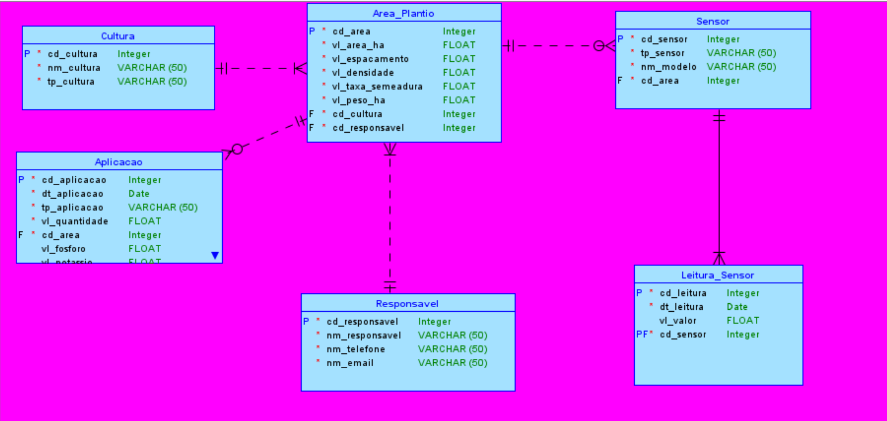
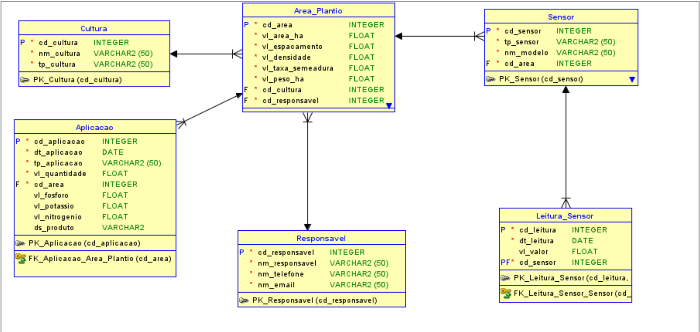
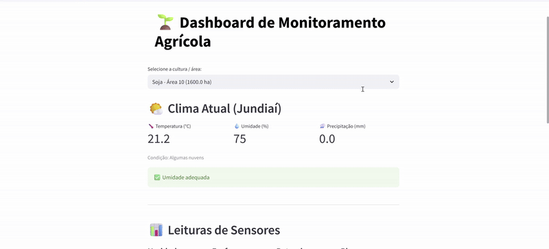

# FIAP - Faculdade de Informática e Administração Paulista

<p align="center">
<a href="https://www.fiap.com.br/"></a>
</p>

<br>

# Farmtech

## Equipe rocket

## 👨‍🎓 Integrantes: 
- <a href="https://www.linkedin.com/in/jonas-silva-0a659892/">Jonas Luis da Silva</a>
- <a href="https://www.linkedin.com/in/renan-francisco-de-paula-b3320915b/overlay/about-this-profile/">Renan Francisco de Paula</a>
- <a href="https://www.linkedin.com/in/jo%C3%A3o-vitor-severo-oliveira-87904134b/">João Vitor Severo Oliveira</a> 
- <a href="https://www.linkedin.com/in/isagomesferreira/">Isabelle Gomes Ferreira</a> 
- <a href="https://www.linkedin.com/in/edson-henrique-felix-batista-a00191123/">Edson Henrique Felix Batista</a>

## 👩‍🏫 Professores:
### Tutor(a) 
- <a href="https://www.linkedin.com/company/inova-fusca">Lucas Gomes Moreira</a>
### Coordenador(a)
- <a href="https://www.linkedin.com/company/inova-fusca">André Godoi Chiovato</a>


---

## 📜 Descrição

Na **Fase04** do projeto FarmTech, migramos para **SQLite** como banco de dados relacional e adicionamos um fluxo de cadastro de usuários (Responsáveis) para futura autenticação. A interface em **Streamlit** ganhou dois módulos de machine learning integrados:

1. **Regressão de Umidade do Solo**: um modelo de RandomForestRegressor que prevê o conteúdo volumétrico de água no solo em diferentes profundidades, servindo como base para a lógica de irrigação automática.
2. **Classificação de Fertilizantes**: um modelo XGBoost que recomenda o tipo de fertilizante ideal com base em temperatura, umidade do solo e níveis de N, P e K.

O dashboard `Home.py` carrega ambos os modelos e apresenta predições em tempo real para o usuário, unificando o monitoramento, controle de irrigação e recomendação de adubação em um único painel interativo.

---

## Contexto e Motivação

Nesta etapa, implementamos o banco de dados em SQLite, ajustamos o modelo para suportar cadastro de Responsáveis, e desenvolvemos pipelines de ML para aumentar a inteligência do sistema. O Streamlit continua preparado para futura comunicação serial com o ESP32 ou via MQTT, mantendo compatibilidade com sensores simulados ou reais.

---

### 🎯 Objetivo Geral

Construir uma **plataforma completa** para:
- Cadastro e gestão de **Responsáveis**, **Culturas** e **Áreas de Plantio** em SQLite.
- Monitoramento de sensores de solo (umidade, pH, nutrientes).
- Suporte à decisão agronômica por meio de:
  - **Regressão** de umidade do solo para controle de irrigação.
  - **Classificação** de fertilizantes recomendados com base em NPK e variáveis climáticas.
- Interface **Streamlit** unificada que carrega e aplica os modelos em tempo real.

---

### 🔧 Principais Funcionalidades

- CRUD completo para Responsáveis, Culturas, Áreas de Plantio, Sensores, Leituras e Aplicações.  
- Pipeline de **Regressão** (RandomForest) para previsão de VW do solo e lógica de irrigação.  
- Pipeline de **Classificação** (XGBoost) para recomendação de fertilizantes.  
- Dashboard Streamlit com controle de parâmetros na **sidebar**.  
- Integração futura com ESP32 via serial ou MQTT.  

---

### 🧱 Estrutura do Modelo

- **Responsavel**: cadastro de usuários/intervenientes com dados de contato.  
- **Cultura**: tipos de culturas agrícolas.  
- **Area_Plantio**: associação entre cultura e responsável, com atributos de área, densidade, produtividade.  
- **Sensor**: mapeamento de sensores por área.  
- **Leitura_Sensor**: data e valor de cada leitura (umidade, pH, N, P, K).  
- **Aplicacao**: registros de adubação (NPK) e aplicações de defensivos (fungicidas), com campos opcionais para cada tipo de insumo.  

---

### 📘 MER (Modelo Entidade-Relacionamento)

📄 [MER_farmtech.pdf](document/MER_farmtech.pdf)

---

### 🖼️ Visão gráfica do DER Lógico e Relacional
  


---  
<!-- O restante do README permanece inalterado -->


---
## 🔌 Lógica e Integração com o ESP32

A primeira parte da entrega contempla a simulação do circuito de sensores utilizando a plataforma **Wokwi** com **ESP32**, representando sensores agrícolas como:

- Sensor de umidade (DHT22)
- Sensor de pH (via LDR)
- Sensor de fósforo e potássio (via botões digitais)
- Relé para simulação de bomba de irrigação (acionado por lógica condicional)

### 📟 Código do ESP32

Segue abaixo o código comentado do ESP32:

````
Inserir aqui
````

### 🖼️ Circuito

  

### 🔁 Integração com Python

- Dados do ESP32 podem ser capturados via **monitor serial**.
- O script Python da aplicação já contém o módulo `irrigar.py`, com lógica pronta e comentada para:
  - Leitura via `serial` do ESP32.
  - Possível futura comunicação via protocolos como **MQTT** para integração em nuvem.
- O banco de dados relacional simula o armazenamento das leituras e aplicações, estando pronto para receber dados reais.
---
### 💧 Irrigação Automática no Home.py

No arquivo `Home.py`, após calcularmos o VW previsto para a profundidade selecionada, chamamos a função `decidir_irriga(vw_pred)` para avaliar se o solo está abaixo do limiar e, então, gerar um status de irrigação:

```python
# Exibe o VW previsto
c4.metric(f"🌊 VW previsto solo ({sel_depth}cm)", f"{vw_pred:.2f} m³/m³")

# Decide se deve irrigar
status = decidir_irriga(vw_pred)
st.write(f"**Status de Irrigação:** {status}")

# (Futuro) aqui poderíamos acionar o relé/ESP32:
if "recomendada" in status:
    ligar_bomba()  # função para ativar o hardware
```
Internamente, decidir_irriga compara o VW previsto a um limiar configurável (ex.: 0.25 m³/m³) e retorna uma mensagem de alerta ou de OK:

```python
def decidir_irriga(vw, limiar=0.25):
    if vw < limiar:
        return f"🚨 Irrigação recomendada (VW abaixo de {limiar*100:.0f}%)"
    else:
        return f"✅ Umidade adequada (VW acima de {limiar*100:.0f}%)"

```
---
### 🚰 Irrigação Proativa

Este sistema não se limita a reagir à umidade atual do solo — ele **antecipa** o nível de água no futuro e decide irrigar **antes** que o solo fique seco.

1. **Previsão “horizon”**  
   O modelo de regressão (RandomForestRegressor) utiliza o VW (volume volumétrico de água) e a temperatura atuais para predizer o VW daqui a *n* horas (definido pelo parâmetro **Horizon**).

2. **Decisão antecipada**  
   Assim que obtemos o valor previsto (`vw_pred`), aplicamos a regra:
   - Se **vw_pred < limiar mínimo** (por exemplo, 0.25 m³/m³), consideramos que o solo ficará seco em breve e **acionamos a irrigação agora**.  
   - Caso contrário, mantemos o sistema desligado.

3. **Benefícios**  
   - **Economia de água**: evita ciclos desnecessários de irrigação.  
   - **Proteção das plantas**: previne estresse hídrico antes que ele ocorra.  
   - **Flexibilidade**: você pode ajustar o **Horizon** e o **limiar** conforme o tipo de cultura.

4. **Automação completa**  
   Basta integrar a chamada de `decidir_irriga(vw_pred)` ao  atuador (via serial, MQTT, GPIO etc.) para que o sistema ligue/desligue a bomba de forma totalmente automática e preventiva.

---
## 🗃️ Justificativa da Modelagem do Banco de Dados

Para esta **Fase04** migramos de Oracle para **SQLite**, simplificando a implantação e o gerenciamento local dos dados. Também introduzimos a tabela `Responsavel` para suportar um fluxo inicial de cadastro de usuários, permitindo no futuro um módulo de autenticação e controle de acesso.

### 🔄 Alterações Realizadas

1. **Migração para SQLite**  
   - Tipo de dados adaptados (ex.: `TEXT` em vez de `VARCHAR2`, `REAL` em vez de `FLOAT`), mantendo a mesma estrutura lógica.

2. **Cadastro de Responsáveis**  
   - Nova tabela `Responsavel` para armazenar operadores/técnicos que gerenciam cada área de plantio.

3. **Tabela Unificada de Aplicação**  
   - A tabela `Aplicacao` foi expandida para registrar tanto **adubações NPK** quanto **defensivos**, sem criar tabelas separadas:
     - `vl_fosforo`, `vl_potassio`, `vl_nitrogenio` (nutrientes aplicados, opcionais).
     - `ds_produto` (nome ou descrição do produto químico).
     - `tp_aplicacao` (indica ‘adubacao’ ou ‘fungicida’).

4. **Atributo de Produtividade**  
   - Em `Area_Plantio` adicionamos/ajustamos o campo `ds_produtividade` para armazenar a produtividade estimada, conforme entrada do usuário.

Esta modelagem unificada garante **flexibilidade** para novos tipos de insumos, **simplicidade** de consultas e **escalabilidade** para futuras integrações (ex. autenticação, relatórios analíticos).

### 🧱 Estrutura Atual do Banco

- `Responsavel`: usuários/técnicos cadastrados.  
- `Cultura`: tipos de cultura agrícola.  
- `Area_Plantio`: áreas vinculadas a cultura e responsável, com área, densidade, produtividade.  
- `Sensor`: sensores alocados por área.  
- `Leitura_Sensor`: registros de leitura (data + valor).  
- `Aplicacao`: aplicações de insumos (nutrientes e defensivos) em uma única tabela.  

### 📌 Vantagens da modelagem atual

- **Simplificação**: menos tabelas dedicadas, menor complexidade de joins.  
- **Flexibilidade**: `Aplicacao` aceita diferentes insumos sem mudanças de esquema.  
- **Evolutividade**: cadastro de `Responsavel` abre caminho para autenticação e audit trail.  
- **Compatibilidade SQLite**: fácil distribuição em campo, sem dependências de servidor externo.

Abaixo segue o SQL final adaptado para SQLite:

```sql
-- SQLite DDL para Farmtech (FASE 4) com seed de Responsável

PRAGMA foreign_keys = ON;

-- Limpa o ambiente caso exista de execuções anteriores
DROP TABLE IF EXISTS Aplicacao;
DROP TABLE IF EXISTS Leitura_Sensor;
DROP TABLE IF EXISTS Sensor;
DROP TABLE IF EXISTS Area_Plantio;
DROP TABLE IF EXISTS Responsavel;
DROP TABLE IF EXISTS Cultura;

-- Criação da tabela Cultura
CREATE TABLE Cultura (
    cd_cultura   INTEGER PRIMARY KEY AUTOINCREMENT,
    nm_cultura   TEXT    NOT NULL,
    tp_cultura   TEXT    NOT NULL
);

-- Criação da tabela Responsavel
CREATE TABLE Responsavel (
    cd_responsavel INTEGER PRIMARY KEY AUTOINCREMENT,
    nm_responsavel TEXT    NOT NULL,
    nm_telefone    TEXT    NOT NULL,
    nm_email       TEXT    NOT NULL
);
-- Seed: usuário padrão para Responsavel
INSERT INTO Responsavel (nm_responsavel, nm_telefone, nm_email)
VALUES ('Responsável Padrão', '(00)0000-0000', 'default@farmtech.local');

-- Criação da tabela Área de Plantio
CREATE TABLE Area_Plantio (
    cd_area           INTEGER PRIMARY KEY AUTOINCREMENT,
    vl_area_ha        REAL    NOT NULL,
    vl_espacamento    REAL    NOT NULL,
    vl_densidade      REAL    NOT NULL,
    vl_taxa_semeadura REAL    NOT NULL,
    vl_peso_ha        REAL    NOT NULL,
    cd_cultura        INTEGER NOT NULL,
    cd_responsavel    INTEGER NOT NULL,
    ds_produtividade  TEXT,
    FOREIGN KEY (cd_cultura)     REFERENCES Cultura(cd_cultura),
    FOREIGN KEY (cd_responsavel) REFERENCES Responsavel(cd_responsavel)
);

-- Criação da tabela Sensor
CREATE TABLE Sensor (
    cd_sensor  INTEGER PRIMARY KEY AUTOINCREMENT,
    tp_sensor  TEXT    NOT NULL,
    nm_modelo  TEXT    NOT NULL,
    cd_area    INTEGER NOT NULL,
    FOREIGN KEY (cd_area) REFERENCES Area_Plantio(cd_area)
);

-- Criação da tabela Leitura de Sensor
CREATE TABLE Leitura_Sensor (
    cd_leitura  INTEGER PRIMARY KEY AUTOINCREMENT,
    cd_sensor   INTEGER NOT NULL,
    dt_leitura  TEXT    NOT NULL,
    vl_valor    REAL,
    FOREIGN KEY (cd_sensor) REFERENCES Sensor(cd_sensor)
);

-- Criação da tabela Aplicacao (adubação / fungicida)
CREATE TABLE Aplicacao (
    cd_aplicacao  INTEGER PRIMARY KEY AUTOINCREMENT,
    dt_aplicacao  TEXT    NOT NULL,
    tp_aplicacao  TEXT    NOT NULL,
    vl_quantidade REAL,
    vl_fosforo    REAL,
    vl_potassio   REAL,
    vl_nitrogenio REAL,
    nm_produto    TEXT,
    cd_area       INTEGER NOT NULL,
    FOREIGN KEY (cd_area) REFERENCES Area_Plantio(cd_area)
);
```

## 🖥️ Funcionamento do Programa Python

O projeto conta hoje com **duas interfaces**:

1. **Linha de comando (CLI)**  
   - Executável via `python main.py`  
   - Menu interativo para:
     - 📥 Inserir dados de cultura, área, aplicações (NPK/fungicida), sensores e leituras  
     - 📋 Listar registros existentes  
     - ✏️ Atualizar área, produtividade, adubações e leituras  
     - 🗑️ Deletar culturas, aplicações e sensores  
   - Toda a lógica de CRUD está em módulos `src/data/crud_*.py` e o menu em `src/main.py` (ou `dados.py`).

2. **Dashboard Web (Streamlit)**  
   - Executável via `streamlit run src/Home.py`  
   - **Duas páginas de treinamento** e previsão:
     - **Regressão de Umidade** (`02_Regressão_de_Umidade.py`): treina e salva modelo de regressão para lógica de irrigação  
     - **Classificação de Fertilizantes** (`03_Classificacao_Fertilizantes.py`): treina e salva modelo XGBoost para recomendar fertilizantes  
   - Em `src/Home.py` são carregados:
     - Conexão com o **SQLite** (`conexao.SQLiteDB`)  
     - Dados de sensores via `Leitura_Sensor` + API de clima (`clima_api.obter_dados_climaticos()`)  
     - Previsão de umidade (regressão) e fertilizante (classificação) com um clique de botão  
   - O Streamlit usa caches (`@st.cache_resource`, `@st.cache_data`) para otimizar carregamento de dados e modelos.

---

### 🔌 Conexão com o Banco de Dados SQLite

A classe `SQLiteDB` em `src/conexao.py` encapsula a conexão e o cursor:

```python
import sqlite3
from contextlib import contextmanager

class SQLiteDB:
    def __init__(self, path: str = "src/model/farmtech.db"):
        self.conn   = sqlite3.connect(path, check_same_thread=False)
        self.conn.row_factory = sqlite3.Row
        self.cursor = self.conn.cursor()

    def __enter__(self):
        return self

    def __exit__(self, exc_type, exc, tb):
        if exc:
            self.conn.rollback()
        else:
            self.conn.commit()
        self.cursor.close()
        self.conn.close()
```
#### 📦 Demonstração do Projeto Python em vídeo no Youtube:

[](https://youtu.be/uHt0W7UsDzY)

## 📊 Descrição do Dashboard Interativo

O sistema conta com uma interface interativa desenvolvida com **Streamlit**, que permite visualizar em tempo real as informações agronômicas das áreas cadastradas.

### 🧭 Navegação

Ao abrir o dashboard com o comando:

```bash
streamlit run Home.py
```

O usuário é guiado por uma interface simples e direta, onde é possível:

### 🔍 Selecionar a Cultura / Área

No topo do painel, há um **selectbox** que permite selecionar a cultura e área de plantio específicas.
As opções são construídas dinamicamente a partir dos dados armazenados no banco SQLite, e cada entrada exibe:

* **Nome da cultura** (ex: Soja, Milho)
* **Código** e **tamanho da área** em hectares

---

### 🌤️ Visualizar Dados Climáticos

A primeira seção exibe os dados meteorológicos atuais obtidos via **API OpenWeather**, incluindo:

* Temperatura atual (°C)
* Umidade relativa do ar (%)
* Precipitação (mm)
* Condição textual do clima (ex: nublado, limpo)

A interface também fornece **alertas visuais** caso a umidade esteja abaixo do ideal para irrigação automática.

---

### 📈 Gráficos de Leituras de Sensores

Esta seção apresenta **gráficos de linha**, agrupados por tipo de sensor, com as leituras históricas da área selecionada. Os sensores incluem:

* Umidade do Solo
* Temperatura(°C)
* pH
* Fósforo (P)
* Potássio (K)
* Nitrogênio (N)

Cada gráfico é gerado a partir da tabela `Leitura_Sensor` e atualizado automaticamente conforme a seleção do usuário.

---

### 🧪 Registros de Aplicações

Exibe as aplicações realizadas na área:

#### 🌾 Adubação

* Data da aplicação
* Quantidade total (kg)
* Valores individuais de P, K e N (kg)

#### 🛡️ Fungicidas

* Data da aplicação
* Nome do produto aplicado
* Volume total (L)

Os dados vêm da tabela `Aplicacao`, que armazena tanto os valores de nutrientes quanto o nome do produto aplicado.

---

### ✅ Benefícios

* Interface simples e intuitiva para usuários não técnicos
* Integração com dados reais e simulados
* Pronto para expansão com dados em tempo real do ESP32 ou via MQTT

> O dashboard apoia a **tomada de decisão agronômica baseada em dados**.


### Demonstração do dashboard em GIF



## ESP32

### Componentes utilizados 

* Placa ESP32
* LCD 16x2(I2C)
* DHT22 - Monitor de temperatura e umidade
* LED Azul - Alerta de umidade baixa
* LED Vermelho - Alerta de temperatura alta

### Funcionalidade

- Monitoramento de temperatura e umidade
- Monitoramento de Nutrientes do solo (NPK), Simulado.
- Alerta visual de temperatura alta e umidade baixa
- LCD - Painel de métricas de temperatura e umidade
- LCD - Paninel de métricas de nutrientes NPK
- Gestão de Serial Plot, podendo ser Nutrientes(NPK) ou Temperatura/Umidade.

### Desmostração


### Links

[Projeto no Wokwi](https://wokwi.com/projects/434237148498906113)

## ✅ Conclusão

O projeto **FarmTech Solutions** na fase04 evoluiu para um sistema ainda mais **robusto e modular**, agora utilizando **SQLite** para armazenamento local e contemplando um **cadastro de usuários** para futuras implementações de acessos. A introdução de dois pipelines de Machine Learning — um de **Regressão** para prever a umidade volumétrica e outro de **Classificação XGBoost** para recomendação de fertilizantes com base nos níveis de NPK, temperatura e umidade — fortalece a lógica de **irrigação inteligente** e **adubação precisa**, respectivamente. Esses modelos são treinados via Streamlit e carregados na página **Home**, permitindo ao usuário gerar previsões em tempo real diretamente pelo dashboard.

A arquitetura mantém a **modelagem relacional normalizada**, garantindo escalabilidade e facilidade de manutenção, além de preparar o sistema para integrações futuras (cadastro de usuários, autenticação e APIs em nuvem).

---

## 📁 Estrutura de Pastas

* **`assets/`**
  Recursos visuais (logos, diagramas MER/DER, GIFs de demonstração).

* **`config/`**
  Modelos de dados e scripts de modelagem (ex: `modeloder.dmd`).

* **`document/`**
  Documentação do projeto (MER, regras de negócio, dataset do treinamento e outros materiais).

* **`model/`**
  Modelos serializados para previsões:

  * `regressor_umidade.pkl`
  * `xgb_fertilizer_recommendation.pkl`
  * eventuais scalers e encoders.

* **`scripts/`**
  Scripts de migração e automação do banco SQLite (ex.`script_Farmetech_sqlite.sql`).

* **`src/`**
  Código-fonte principal:

  * **`Home.py`**: Dashboard Streamlit unificado.
  * **`pages/02_Regressão_de_Umidade.py`**: Treinamento do modelo de regressão.
  * **`pages/03_Classificacao_Fertilizantes.py`**: Treinamento do XGBoost.
  * **`interface.py`**, **`irrigar.py`**, **`dados.py`**: módulos auxiliares.
  * **`data/`**: operações CRUD para cada entidade.
  * **`model/`**: função de carregamento e previsão dos modelos.
  * Outros arquivos de configuração e estilização.

* **`esp32/`**
  Código do microcontrolador para sensores e atuadores (Wokwi/ESP32).

* **`README.md`**
  Este arquivo atualizado com instruções, estrutura do projeto e demonstrações.


---

## 🔧 Como executar o código

* É necessário ter Python 3.x instalado.

### 1. Clone o repositório:

```bash
git clone https://github.com/seuusuario/Farmtech.git
```

### 2. Instale as dependências:

```bash
pip install -r requirements.txt
```

> O `requirements.txt` já inclui:
>
> * pandas
> * numpy
> * scikit-learn
> * xgboost
> * streamlit
> * sqlite3 (já incluso no Python)
> * joblib
> * matplotlib
> * seaborn
> * python-dotenv

### 3. Configure as variáveis de ambiente

Copie o arquivo `.env.example` para `.env` e defina sua chave `OPENWEATHER_API_KEY`.

### 4. Crie o banco de dados SQLite

O script SQL para criar as tabelas está em `src/model/script_Farmtech_sqlite.sql`. Execute:

```bash
sqlite3 farmtech.db < src/model/script_Farmtech_sqlite.sql
```

### 5. Execute o programa de linha de comando

```bash
cd src
python main.py
```

### 6. Abra o dashboard Streamlit

```bash
streamlit run Home.py
```

---

## 🗃 Histórico de lançamentos

* **0.4.0 - 20/06/2025**

  * Migração para SQLite
  * Cadastro de usuários integrado
  * Pipelines de regressão (irrigação) e classificação (ferrtilização)
  * Exportação de modelos e previsão via página Home

* **0.3.0 - 19/05/2025**

  * CRUD completo
  * Dashboard com Streamlit
  * Aplicações modeladas com NPK e produto
  * Coleta de dados simulados via sensores e ESP32

* **0.2.0 - 22/04/2025**

  * Modelagem finalizada com regras de negócio, MER e DER

* **0.1.0 - 25/03/2025**

  * Estrutura inicial e simulação de entrada/saída de dados em JSON


## 📋 Licença


<p xmlns:cc="http://creativecommons.org/ns#" xmlns:dct="http://purl.org/dc/terms/">
<a property="dct:title" rel="cc:attributionURL" href="https://github.com/agodoi/template">MODELO GIT FIAP</a> por 
<a rel="cc:attributionURL dct:creator" property="cc:attributionName" href="https://fiap.com.br">Fiap</a> está licenciado sob 
<a href="http://creativecommons.org/licenses/by/4.0/?ref=chooser-v1" target="_blank" rel="license noopener noreferrer" style="display:inline-block;">Attribution 4.0 International</a>.
</p>
