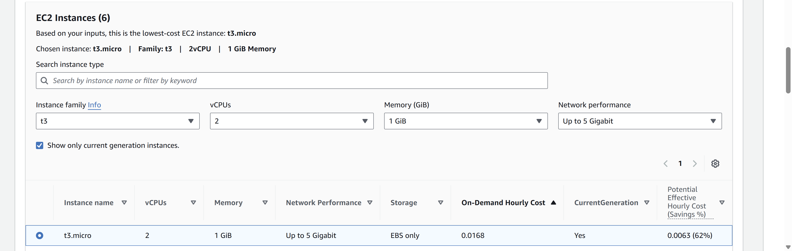
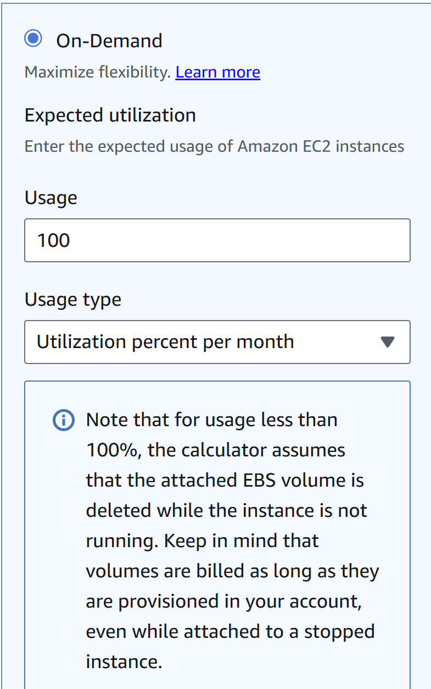
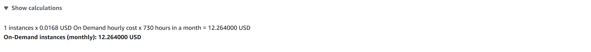
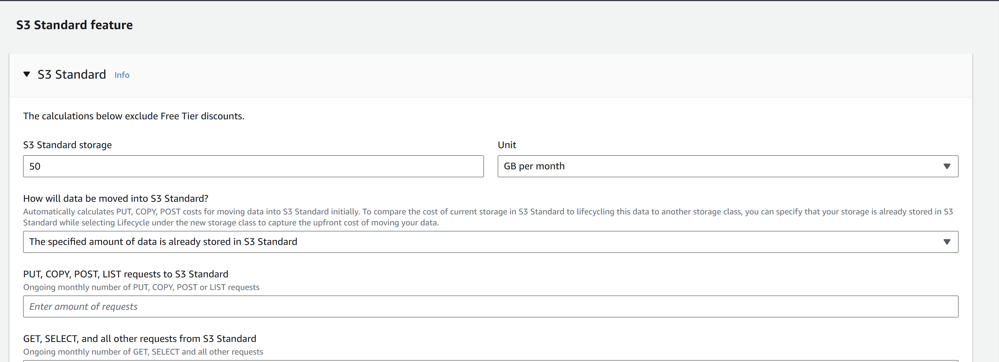
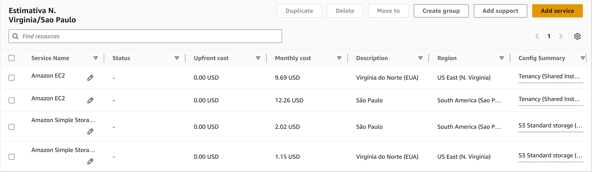

# FIAP - Faculdade de Informática e Administração Paulista

<p align="center">
  <a href="https://www.fiap.com.br/">
    
  </a>
</p>

<br>

# FarmTech — Fase 05 (ML + Cloud)

## Equipe Rocket

## 👨‍🎓 Integrantes

- <a href="https://www.linkedin.com/in/jonas-silva-0a659892/">Jonas Luis da Silva</a>
- <a href="https://www.linkedin.com/in/renan-francisco-de-paula-b3320915b/overlay/about-this-profile/">Renan Francisco de Paula</a>
- <a href="https://www.linkedin.com/in/jo%C3%A3o-vitor-severo-oliveira-87904134b/">João Vitor Severo Oliveira</a>
- <a href="https://www.linkedin.com/in/isagomesferreira/">Isabelle Gomes Ferreira</a>
- <a href="https://www.linkedin.com/in/edson-henrique-felix-batista-a00191123/">Edson Henrique Felix Batista</a>

## 👩‍🏫 Professores

**Tutor:** <a href="https://www.linkedin.com/company/inova-fusca">Lucas Gomes Moreira</a>  
**Coordenador:** <a href="https://www.linkedin.com/company/inova-fusca">André Godoi Chiovato</a>

---

> **Importante:** conforme o enunciado, **este README é apenas um guia de navegação**. Toda a descrição completa, análises, gráficos e conclusões da entrega 1 **estão dentro do Jupyter Notebook** desta fase. Não repetimos aqui o conteúdo do notebook.

## 📌 Conteúdo da Fase 05

- **Entrega 1 (Machine Learning):** EDA do `crop_yield.csv`, **clusterização (tendências)** e **5 modelos de regressão** para prever **rendimento (t/ha)**.
- **Entrega 2 (Cloud – AWS):** **Estimativa de custos On-Demand (100%)** para hospedar API + ML (Linux, **2 vCPUs**, **1 GiB RAM**, **até 5 Gbps**, **50 GB HD**), comparando **São Paulo (BR)** × **N. Virginia (EUA)**, com **justificativa técnica** (acesso, latência e restrições legais).

---

# FIAP - Faculdade de Informática e Administração Paulista

<p align="center">
  <a href="https://www.fiap.com.br/">
    
  </a>
</p>

<br>

# FarmTech — Fase 05 (ML + Cloud)

## Equipe Rocket

## 👨‍🎓 Integrantes

- <a href="https://www.linkedin.com/in/jonas-silva-0a659892/">Jonas Luis da Silva</a>
- <a href="https://www.linkedin.com/in/renan-francisco-de-paula-b3320915b/overlay/about-this-profile/">Renan Francisco de Paula</a>
- <a href="https://www.linkedin.com/in/jo%C3%A3o-vitor-severo-oliveira-87904134b/">João Vitor Severo Oliveira</a>
- <a href="https://www.linkedin.com/in/isagomesferreira/">Isabelle Gomes Ferreira</a>
- <a href="https://www.linkedin.com/in/edson-henrique-felix-batista-a00191123/">Edson Henrique Felix Batista</a>

## 👩‍🏫 Professores

**Tutor:** <a href="https://www.linkedin.com/company/inova-fusca">Lucas Gomes Moreira</a>  
**Coordenador:** <a href="https://www.linkedin.com/company/inova-fusca">André Godoi Chiovato</a>

---

> **Importante:** conforme o enunciado, **este README é apenas um guia de navegação**. Toda a descrição completa, análises, gráficos e conclusões **estão dentro do Jupyter Notebook** desta fase. Não repetimos aqui o conteúdo do notebook.

## Entrega 1

## 📌 Conteúdo da Fase 05

- **Entrega 1 (Machine Learning):** EDA do `crop_yield.csv`, **clusterização (tendências)** e **5 modelos de regressão** para prever **rendimento (t/ha)**.
- **Entrega 2 (Cloud – AWS):** **Estimativa de custos On-Demand (100%)** para hospedar API + ML (Linux, **2 vCPUs**, **1 GiB RAM**, **até 5 Gbps**, **50 GB HD**), comparando **São Paulo (BR)** × **N. Virginia (EUA)**, com **justificativa técnica** (acesso, latência e restrições legais).

---

## 🚀 Acesso rápido

# 📓 Notebook — Fase 05 (ML + Cloud)

> Este README é **apenas um guia** para abrir e reproduzir o notebook.  
> Toda a explicação detalhada (EDA, clusterização, modelos, métricas e conclusões) está **dentro do Jupyter**.

## 🔗 Acesso rápido

- **Notebook principal:** [`Jonas_rm561465_pbl_fase5.ipynb`](./src/notebooks/Jonas_rm561465_pbl_fase5.ipynb)
- **Dataset:** [`data/crop_yield.csv`](../data/crop_yield.csv)
- **Prints AWS Calculator:** [`aws/screenshots/`](./aws/screenshots/)
- **Vídeos (não listados):**
  - Entrega 1 (ML): https://youtu.be/svwXQuMFJWw
  - Entrega 2 (AWS): https://youtu.be/JwBOi_SjG9M

---

## 🧪 Como reproduzir (mínimo para correção)

```bash
# 1) Ambiente virtual
python -m venv .venv

# Linux/Mac
source .venv/bin/activate
# Windows (CMD)
.\.venv\Scripts\activate
# Windows (PowerShell)
.\.venv\Scripts\Activate.ps1

# 2) Dependências essenciais
pip install -U pip
pip install numpy pandas scikit-learn matplotlib jupyter

# 3) Abrir o notebook
jupyter notebook Fase_05/JonasLuisdaSilva_rm561465_pbl_fase4.ipynb
```

---

## ☁️ Entrega 2 — EC2 + S3 (AWS)

### 🎯 Objetivo

Comparar custo **On-Demand (100%)** entre **us-east-1 (N. Virginia)** e **sa-east-1 (São Paulo)** para:

- **EC2 (API + ML):** `t3.micro` — **2 vCPU, 1 GiB, up to 5 Gbps, Linux**
- **S3 (dados dos sensores):** **S3 Standard, 50 GB**

---

### 🧮 Como reproduzir no AWS Pricing Calculator

#### A) EC2 (Compute)

1. **Add service → Amazon EC2**
2. **Region:** `us-east-1 (N. Virginia)`
3. **Tenancy:** Shared · **OS:** Linux · **Workload:** Constant usage · **Instances:** 1
4. Em **EC2 Instances**:
   - **Instance family:** `t3` · **vCPUs:** `2` · **Memory:** `1 GiB` · **Network:** _Up to 5 Gigabit_
   - Selecione **`t3.micro`** (linha marcada na grade).
5. **Purchase options:** marque **On-Demand** (nada de Savings/Reserved/Spot).
6. Clique em **Show calculations** e anote o valor “**On-Demand instances (monthly)**”.
7. **Duplicate** a estimativa e troque **Region** para `sa-east-1 (São Paulo)`.

**Prints (VA):**

- **Tela com `t3.micro` selecionada**  
  

- **On-Demand**  
  

- **Show calculations (mensal)**  
  

**Prints (SP):**

- **Tela com `t3.micro` selecionada**  
  

- **On-Demand**  
  

- **Show calculations (mensal)**  
  

#### B) S3 (Storage)

1. **Add service → Amazon S3** (faça **um S3 por região**).
2. **Region:** mesma da EC2 (VA e SP separadamente).
3. **Storage class:** **S3 Standard**
4. **Storage amount:** **50** (GB per month)
5. Deixe **PUT/GET** e **Data** em **0** para este comparativo.

**Prints (VA e SP):**

- **Hard Drive — N. Virginia**  
  

- **Hard Drive — São Paulo**  
  

**Estimativa:**

- **Estimate summary**  
  

---

### 💰 Tabela de custos (On-Demand 100%)

| Item                       | us-east-1 (N. Virginia) | sa-east-1 (São Paulo) |
| -------------------------- | ----------------------- | --------------------- |
| **EC2 t3.micro (compute)** | **US$ 9,69/mês**        | **US$ 12,26/mês**     |
| **S3 Standard (50 GB)**    | **US$ 1,15/mês**        | **US$ 2,02/mês**      |
| **Total mensal**           | **US$ 10,75**           | **US$ 14,28**         |
| Diferença (SP – VA)        |                         | **US$ (3,53)**        |

> Observação: O enunciado fala “HD”, mas armazenamento gerenciado recomendado para dados dos sensores é **S3**. No seu cálculo principal mantivemos **S3**.

---

### ✅ Decisão

**Escolhemos `sa-east-1 (São Paulo)`**.  
**Justificativa técnica:**

- **Conformidade:** requisito de **residência de dados** no Brasil (dados dos sensores ficam no **S3 em SP**).
- **Baixa latência:** ingestão dos sensores nacionais → **API (EC2)** e **S3** na **mesma região**, reduzindo RTT.
- **Trade-off:** **SP custa mais** do que N. Virginia; aceitamos o custo por **compliance** e **desempenho de ingestão**.

---

### 🗺️ Arquitetura sugerida (resumo)

- **EC2 t3.micro** (FastAPI/Flask) em **sa-east-1**, atrás de **Security Groups** (porta 80/443).
- **S3 (sa-east-1)** para dados brutos/agrupados por cultura/dia; **Lifecycle** para arquivar históricos (IA/Glacier).
- **IAM mínimo:** API com permissão `s3:PutObject` no bucket; leitura restrita.
- **(Opcional)** VPC Endpoint para S3 (tráfego privado) e ALB/ASG ao escalar.

---

### 🎬 Vídeo

1. EC2 **VA**: selecionar `t3.micro` + **On-Demand** → **Show calculations**.
2. Duplicar para **SP** e repetir.
3. Adicionar **S3 Standard 50 GB** em **VA** e em **SP** (mostrar monthly).
4. Mostrar os **prints** e a **tabela** no README.
5. Concluir: **escolha por São Paulo** (compliance + latência) e o **trade-off de custo**.

---

## 📁 Estrutura de Pastas (Fase 05)

- **`Fase_05/`**
  - **`README.md`** — Guia curto que aponta para o notebook, dataset, prints da AWS e vídeos.
  - **`data/`**
    - `crop_yield.csv`
  - **`aws/`**
    - **`screenshots/`**
      - `calc-sp.png`
      - `calc-virginia.png`
  - **`assets/`**
    - `logo-fiap.png`
  - **`src/notebooks`**
    - `JonasLuisdaSilva_rm561465_pbl_fase4.ipynb`\*\* — Notebook completo da Entrega 1 (ML).

---

## 🗃 Histórico de lançamentos

- **0.5.0 - 09/09/2025**

  - **Entrega 1 (ML):** EDA do `crop_yield.csv`, clusterização **KMeans (k=6 por silhueta)**, 5 modelos de regressão, validação `RepeatedKFold`, métricas **RMSE/MAE/R²**. Notebook `JonasLuisdaSilva_rm561465_pbl_fase4.ipynb` com todas as células executadas.
  - **Entrega 2 (Cloud – AWS):** Estimativa **On-Demand (100%)** para Linux **2 vCPUs, 1 GiB RAM, até 5 Gbps, 50 GB (HD)**; comparação **São Paulo (BR)** × **N. Virginia (EUA)**; **justificativa técnica**. Prints adicionados em `Fase_05/aws/screenshots/`.
  - **README (Fase 05):** guia minimalista apontando para notebook, dataset, prints e vídeos.

- **0.4.0 - 20/06/2025**

  - Migração para SQLite
  - Cadastro de usuários integrado
  - Pipelines de regressão (irrigação) e classificação (fertilização)
  - Exportação de modelos e previsão via página Home

- **0.3.0 - 19/05/2025**

  - CRUD completo
  - Dashboard com Streamlit
  - Aplicações modeladas com NPK e produto
  - Coleta de dados simulados via sensores e ESP32

- **0.2.0 - 22/04/2025**

  - Modelagem finalizada com regras de negócio, MER e DER

- **0.1.0 - 25/03/2025**
  - Estrutura inicial e simulação de entrada/saída de dados em JSON

## 📋 Licença


<p xmlns:cc="http://creativecommons.org/ns#" xmlns:dct="http://purl.org/dc/terms/">
<a property="dct:title" rel="cc:attributionURL" href="https://github.com/agodoi/template">MODELO GIT FIAP</a> por 
<a rel="cc:attributionURL dct:creator" property="cc:attributionName" href="https://fiap.com.br">Fiap</a> está licenciado sob 
<a href="http://creativecommons.org/licenses/by/4.0/?ref=chooser-v1" target="_blank" rel="license noopener noreferrer" style="display:inline-block;">Attribution 4.0 International</a>.
</p>
